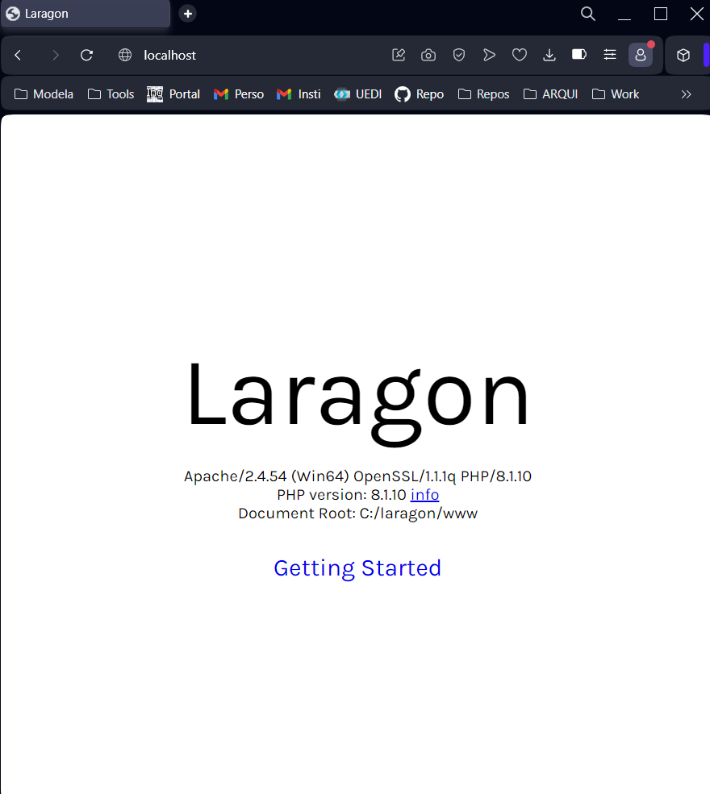

# My PHP road
Interpreted languaje. 

Open source.

Suited for web development and can be embedded into HTML.

### Ways to run PHP

* Local Server (XAMPP, Laragon, EasyPHP)
* Hosting

### First steps
* Iniciando Laragon

    

* Ruta "localhost"

    

* phpMyAdmin

    

### Handle PHP proyects
| Create proyect folder in file system | Navigate on localhost |
| -- | -- |
|  |  |

### Editor
Add php executable path in json settings

