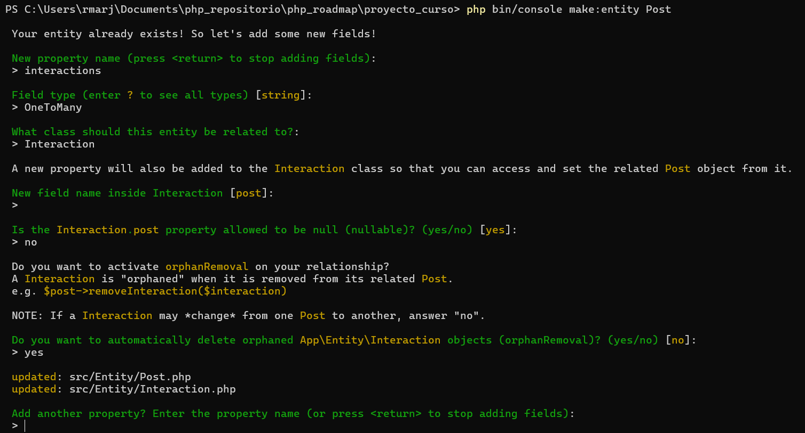

# Mi primer proyecto en symfony

### Creación de nuevo proyecto
~~~
cd ruta_creación
symfony new --webapp nombre_proyecto
cd nombre_proyecto
symfony serve
~~~

Carpetas principales
* public (imágenes, estilos)
* src (controlador, consultas, entidades)
* templates (plantillas twig)
* var (caché y logs)
* bin (comandos)

### Composer
gestor de dependencias, es decir, permite descargar código de otros y utilizarlo en el nuestro.

Todo lo que se encuentra en los requires de composer.json se encuentran en la carpeta vendor. Por medio del siguiente comando se instalan todas las versiones necesarias.
~~~
composer install
~~~

### Crear base de datos
Bases de datos soportadas: SQLite, SQL Server, SAP Sybase SQL Anywhere, MySQL, Oracle, PostgreSQL.
En .env descomentar la línea de la base de datos
~~~
DATABASE_URL="mysql://db_user:db_pass@db_host:db_port/db_name?serverVersion=8&charset=utf8mb4"
~~~

En la carpeta del proyecto ejecutar
~~~
php bin/console doctrine:database:create
~~~

En symfony las tablas de base de datos se representan con entidades.
~~~
php bin/console make:User
php bin/console make:entity Nombre_entidad
~~~

Agregar relaciones 

Cargar en la base de datos
~~~
php bin/console doctrine:schema:update --force
~~~

Verificar que Doctrine puede comunicarse con la base de datos
~~~
php bin/console doctrine:schema:validate
~~~

>Doctrine Query Language DQL :(

### Controlador
~~~
php bin/console make:controller
~~~
> Choose a name for your controller class (e.g.
> GentlePuppyController):
 > PostController

 